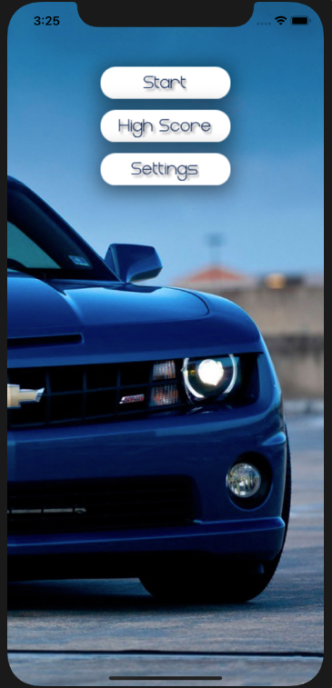

# Racing
___
## Оглавление
- **[Описание](#Description)**
- **[Презентация](#Presentation)**
- **[В планах сделать](#ToDo)**

## Описание
2D игра гоночки. Учебный проект.

- Проект написан на **UIKit**
- Использована стандартная архитектура **MVC**
- Верстка интерфейса **Кодом + Storyboard**
- Анимация основана на **UIView.animate + Timer**
- Сохранение настроек и результатов игры: **UserDefaults**

___

## Презентация
### Основной экран

### Экран игры

### Экран результатов

### Экран настроек

___

## В планах сделать:
1. Добавить музыку и звуки
2. Добавить локализацию
3. Добавить акселерометр
4. Встряхивание телефона = прыжок машины
5. Добавить параллакс в экран меню гонок
6. Подключить Crashlytics

